<div align="right">
  <details>
    <summary >🌐 Language</summary>
    <div>
      <div align="center">
        <a href="https://openaitx.github.io/view.html?user=icip-cas&project=PPTAgent&lang=en">English</a>
        | <a href="https://openaitx.github.io/view.html?user=icip-cas&project=PPTAgent&lang=zh-CN">简体中文</a>
        | <a href="https://openaitx.github.io/view.html?user=icip-cas&project=PPTAgent&lang=zh-TW">繁體中文</a>
        | <a href="https://openaitx.github.io/view.html?user=icip-cas&project=PPTAgent&lang=ja">日本語</a>
        | <a href="https://openaitx.github.io/view.html?user=icip-cas&project=PPTAgent&lang=ko">한국어</a>
        | <a href="https://openaitx.github.io/view.html?user=icip-cas&project=PPTAgent&lang=hi">हिन्दी</a>
        | <a href="https://openaitx.github.io/view.html?user=icip-cas&project=PPTAgent&lang=th">ไทย</a>
        | <a href="https://openaitx.github.io/view.html?user=icip-cas&project=PPTAgent&lang=fr">Français</a>
        | <a href="https://openaitx.github.io/view.html?user=icip-cas&project=PPTAgent&lang=de">Deutsch</a>
        | <a href="https://openaitx.github.io/view.html?user=icip-cas&project=PPTAgent&lang=es">Español</a>
        | <a href="https://openaitx.github.io/view.html?user=icip-cas&project=PPTAgent&lang=it">Italiano</a>
        | <a href="https://openaitx.github.io/view.html?user=icip-cas&project=PPTAgent&lang=ru">Русский</a>
        | <a href="https://openaitx.github.io/view.html?user=icip-cas&project=PPTAgent&lang=pt">Português</a>
        | <a href="https://openaitx.github.io/view.html?user=icip-cas&project=PPTAgent&lang=nl">Nederlands</a>
        | <a href="https://openaitx.github.io/view.html?user=icip-cas&project=PPTAgent&lang=pl">Polski</a>
        | <a href="https://openaitx.github.io/view.html?user=icip-cas&project=PPTAgent&lang=ar">العربية</a>
        | <a href="https://openaitx.github.io/view.html?user=icip-cas&project=PPTAgent&lang=fa">فارسی</a>
        | <a href="https://openaitx.github.io/view.html?user=icip-cas&project=PPTAgent&lang=tr">Türkçe</a>
        | <a href="https://openaitx.github.io/view.html?user=icip-cas&project=PPTAgent&lang=vi">Tiếng Việt</a>
        | <a href="https://openaitx.github.io/view.html?user=icip-cas&project=PPTAgent&lang=id">Bahasa Indonesia</a>
        | <a href="https://openaitx.github.io/view.html?user=icip-cas&project=PPTAgent&lang=as">অসমীয়া</a>
      </div>
    </div>
  </details>
</div>

<div align="center">
  
</div>

https://github.com/user-attachments/assets/938889e8-d7d8-4f4f-b2a1-07ee3ef3991a

## 📫 Contact
> The main contributor of this repo is a Master's student graduating in 2026, feel free to reach out for collaboration or opportunities.
>
> 本仓库的主要贡献者是一名 2026 届硕士毕业生，欢迎联系合作或交流机会。

<div align="center">
  
</div>

## 📅 News
- [2026/01]: We support freeform and template generation support PPTX export, offline mode now! Context management is added to avoid context overflow.
- [2025/12]: 🔥 Released V2 with major improvements - Deep Research Integration, Free-Form Visual Design, Autonomous Asset Creation, Text-to-Image Generation, and Agent Environment with sandbox & 20+ tools.
- [2025/09]: 🛠️ MCP server support added - see [MCP Server](PPTAgent/DOC.md#mcp-server-) for configuration details
- [2025/09]: 🚀 Released v2 with major improvements - see [release notes](https://github.com/icip-cas/PPTAgent/releases/tag/v0.2.0) for details
- [2025/08]: 🎉 Paper accepted to **EMNLP 2025**!
- [2025/05]: ✨ Released v1 with core functionality and 🌟 breakthrough: reached 1,000 stars on GitHub! - see [release notes](https://github.com/icip-cas/PPTAgent/releases/tag/v0.1.0) for details
- [2025/01]: 🔓 Open-sourced the codebase, with experimental code archived at [experiment release](https://github.com/icip-cas/PPTAgent/releases/tag/experiment)

## 📖 Usage

> [!IMPORTANT]
> 1. All these API keys, configurations, and services are **required**.
> 2. Agent Backbone Recommendation: Use Claude for the Research Agent and Gemini for the Design Agent. GLM-4.7 is also a good choice in open-source models.
> 3. Offline mode is supported with limited capabilities (see Offline Setup below).


### 1. Environment Configuration

- **Create configuration files** (from project root):

  ```bash
  cp deeppresenter/deeppresenter/config.yaml.example deeppresenter/deeppresenter/config.yaml
  cp deeppresenter/deeppresenter/mcp.json.example deeppresenter/deeppresenter/mcp.json
  ```

- **Online setup**:
  - **MinerU**: Apply for an API key at [mineru.net](https://mineru.net/apiManage/docs). Note that each key is valid for 14 days.
  - **Tavily**: Apply for an API key at [tavily.com](https://www.tavily.com/).
  - **LLM**: Set your model endpoint, API keys, and related parameters in `config.yaml`.

- **Offline setup**:
  - **MinerU**: Deploy the MinerU server by following the instructions at [MinerU docker guide](https://opendatalab.github.io/MinerU/quick_start/docker_deployment/#start-services-directly-with-docker-compose)
  - **Config switch**: Set `offline_mode: true` in [`config.yaml`](deeppresenter/deeppresenter/config.yaml) to avoid loading network-dependent tools (e.g., `fetch`, `search`).
  - **MinerU endpoint**: Set `MINERU_API_URL` in [`mcp.json`](deeppresenter/deeppresenter/mcp.json) to your local MinerU service URL

### 2. Service Startup

Build docker images: `docker compose build`

- **From Docker Compose**:

  ```bash
  docker compose up -d
  ```

- **Running locally**:

  ```bash
  cd deeppresenter
  pip install -e .
  playwright install-deps
  playwright install chromium
  npm install
  npx playwright install chromium
  python webui.py
  ```

> [!TIP]
> 🚀 All configurable variables can be found in [constants.py](deeppresenter/deeppresenter/utils/constants.py).

## 💡 Case Study

- #### Prompt: Please present the given document to me.

<div style="display: flex; flex-wrap: wrap; gap: 10px;">

  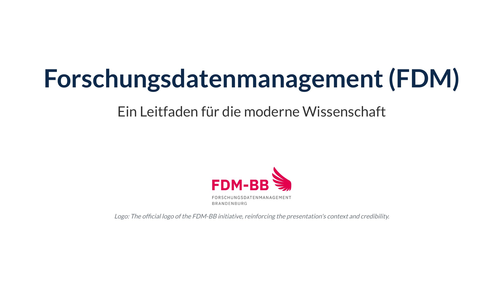

  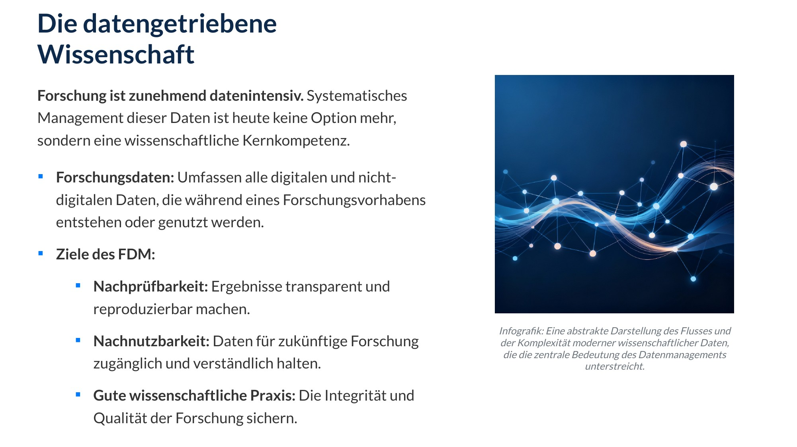

  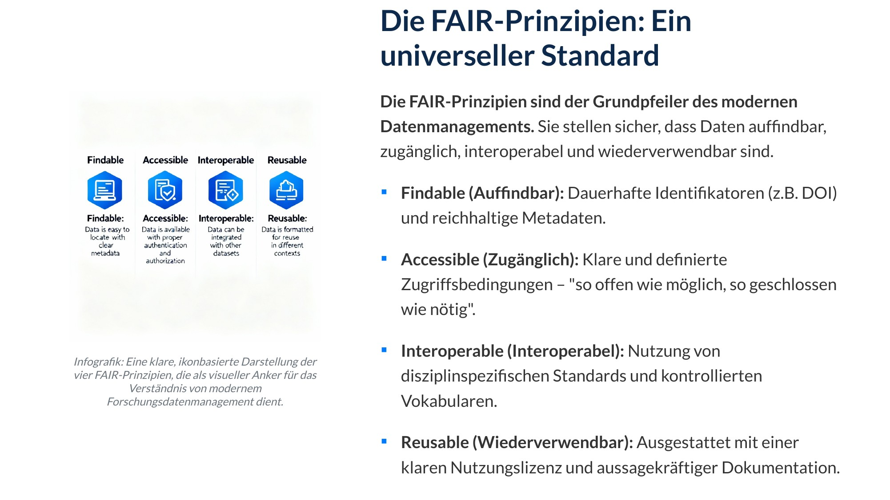

  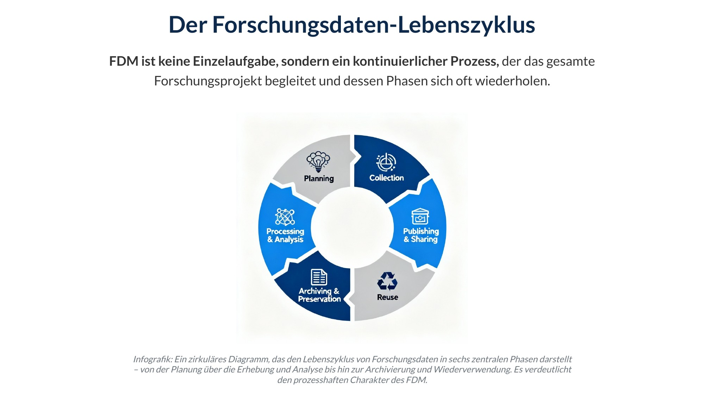

  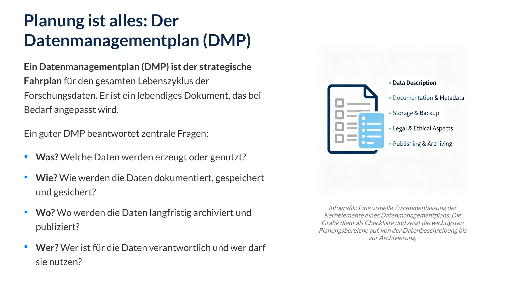

  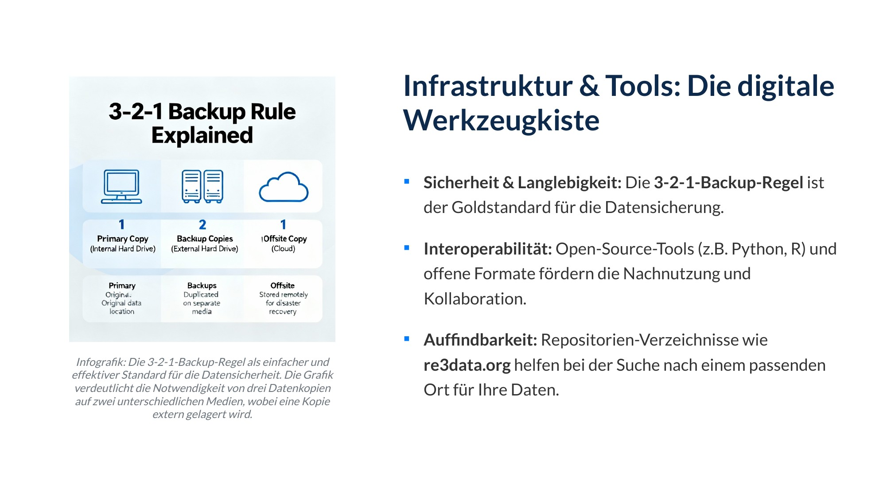

  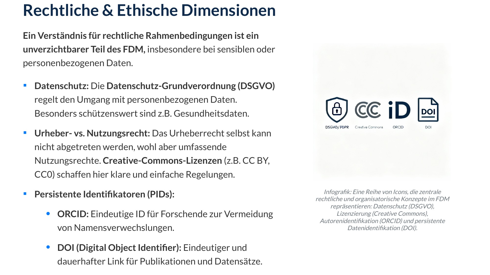

  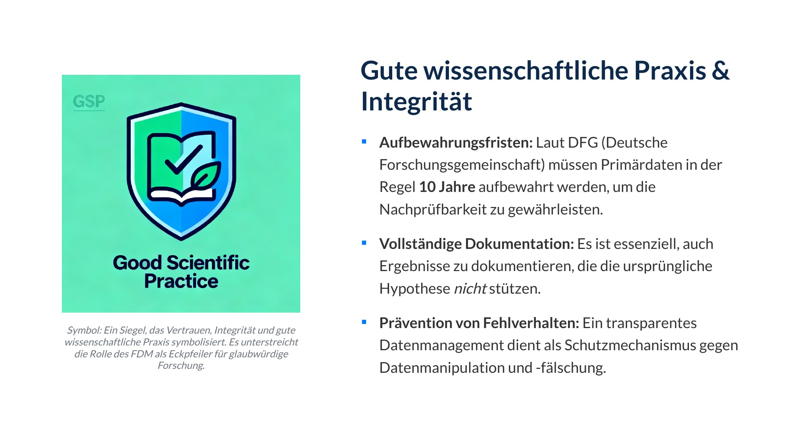

  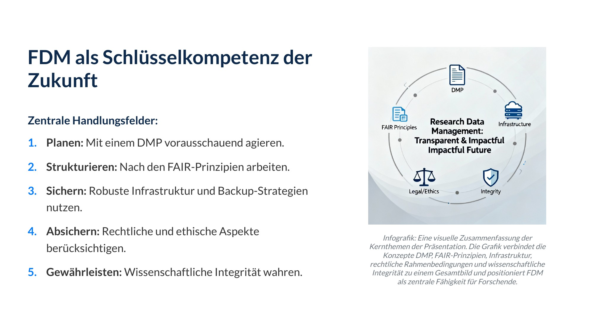

  

</div>

- #### Prompt: 请介绍小米 SU7 的外观和价格

<div style="display: flex; flex-wrap: wrap; gap: 10px;">

  

  

  

  

  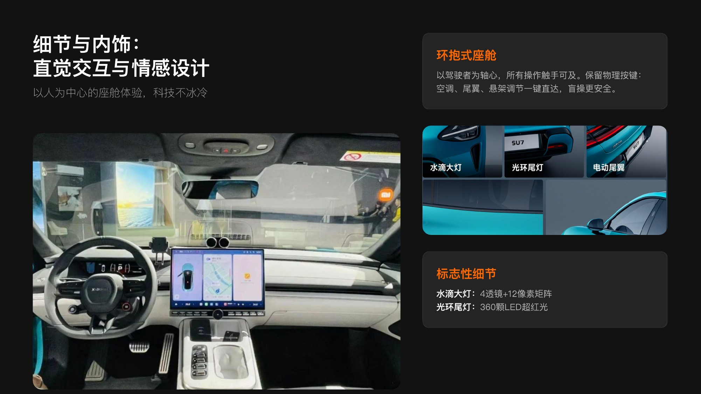

  

</div>

- #### Prompt: 请制作一份高中课堂展示课件，主题为“解码立法过程：理解其对国际关系的影响”

<div style="display: flex; flex-wrap: wrap; gap: 10px;">

  

  

  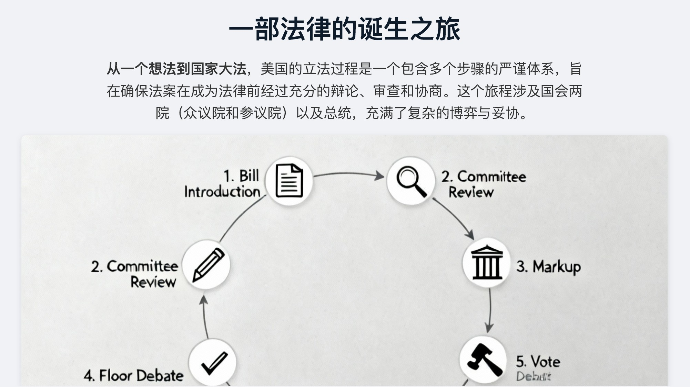

  

  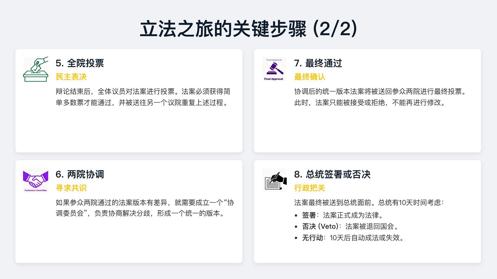

  

  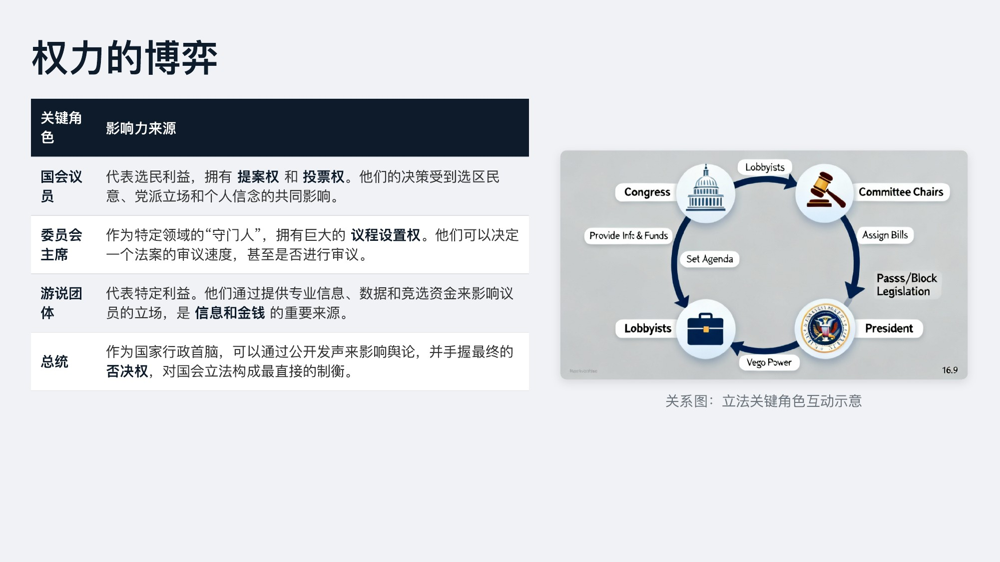

  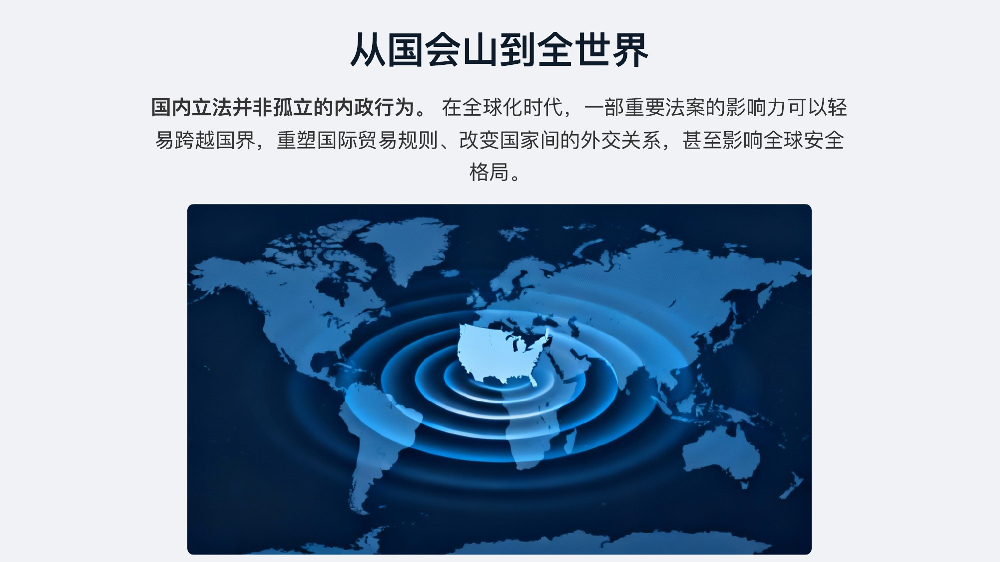

  

  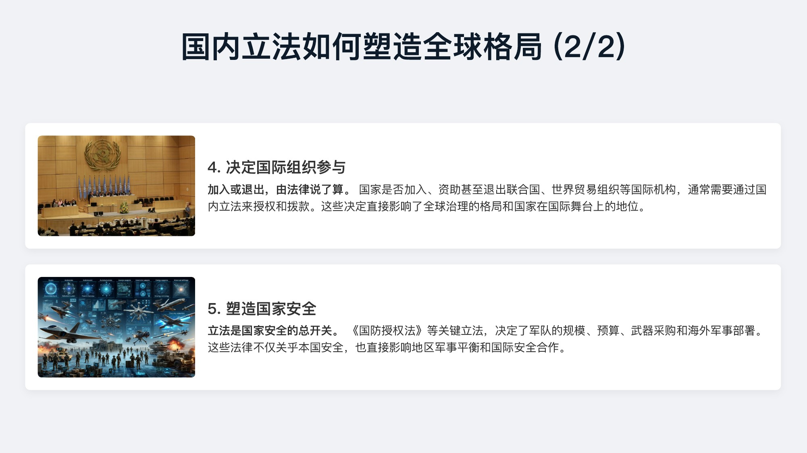

  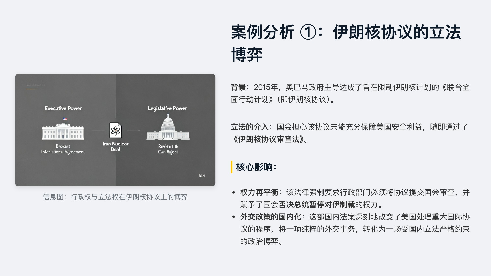

  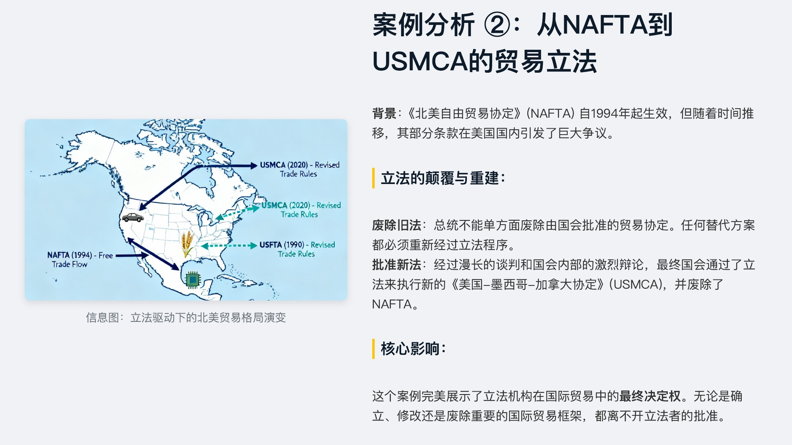

  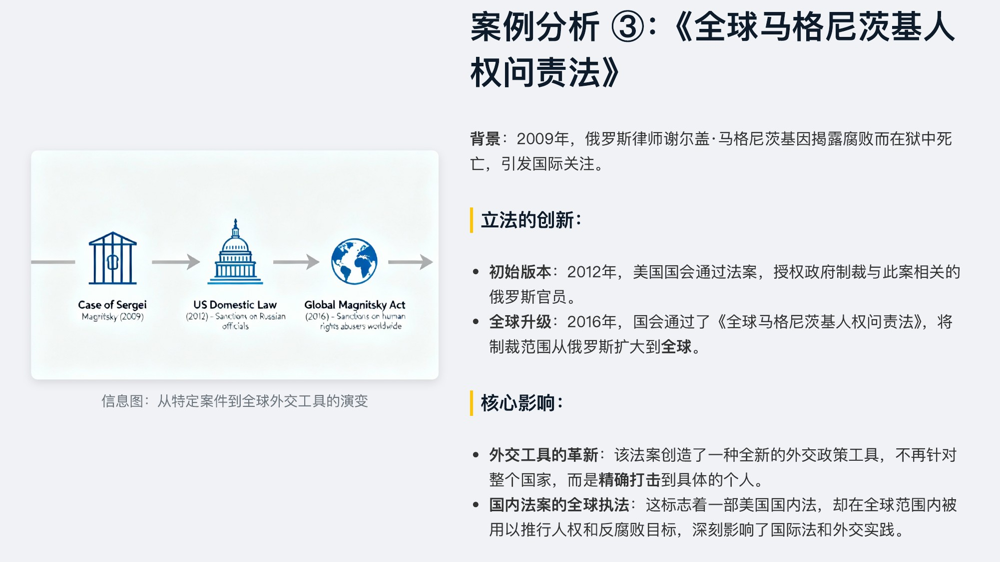

  

  

</div>

---


[](https://star-history.com/#icip-cas/PPTAgent&Date)

## Citation 🙏

If you find this project helpful, please use the following to cite it:
```bibtex
@inproceedings{zheng-etal-2025-pptagent,
    title = "{PPTA}gent: Generating and Evaluating Presentations Beyond Text-to-Slides",
    author = "Zheng, Hao  and
      Guan, Xinyan  and
      Kong, Hao  and
      Zhang, Wenkai  and
      Zheng, Jia  and
      Zhou, Weixiang  and
      Lin, Hongyu  and
      Lu, Yaojie  and
      Han, Xianpei  and
      Sun, Le",
    editor = "Christodoulopoulos, Christos  and
      Chakraborty, Tanmoy  and
      Rose, Carolyn  and
      Peng, Violet",
    booktitle = "Proceedings of the 2025 Conference on Empirical Methods in Natural Language Processing",
    month = nov,
    year = "2025",
    address = "Suzhou, China",
    publisher = "Association for Computational Linguistics",
    url = "https://aclanthology.org/2025.emnlp-main.728/",
    doi = "10.18653/v1/2025.emnlp-main.728",
    pages = "14413--14429",
    ISBN = "979-8-89176-332-6",
    abstract = "Automatically generating presentations from documents is a challenging task that requires accommodating content quality, visual appeal, and structural coherence. Existing methods primarily focus on improving and evaluating the content quality in isolation, overlooking visual appeal and structural coherence, which limits their practical applicability. To address these limitations, we propose PPTAgent, which comprehensively improves presentation generation through a two-stage, edit-based approach inspired by human workflows. PPTAgent first analyzes reference presentations to extract slide-level functional types and content schemas, then drafts an outline and iteratively generates editing actions based on selected reference slides to create new slides. To comprehensively evaluate the quality of generated presentations, we further introduce PPTEval, an evaluation framework that assesses presentations across three dimensions: Content, Design, and Coherence. Results demonstrate that PPTAgent significantly outperforms existing automatic presentation generation methods across all three dimensions."
}
```

## Contributors
